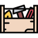

<h1 align="center">𝐑𝐄𝐀𝐃𝐌𝐄 𝟏𝟎𝟏</h1>

 

<i><b>Tools for Creating Awesome README !</b></i>

## ToC
- [README 101](#readme-101)
- [Discussions](#discussions)
- [Statistic](#statistic)
- [Contributors](#contributors)
- [License](#license)

## README 101

 

<table border="0" align='center'>
<tr>

<td>
<b>Learning</b>
</td>
<td>
<b>Toolkit</b>
</td>
<td>
<b>Templates</b>
</td>
<td></td>
</table>

 

## Discussions 
## Statistic
## Contributors
## License

